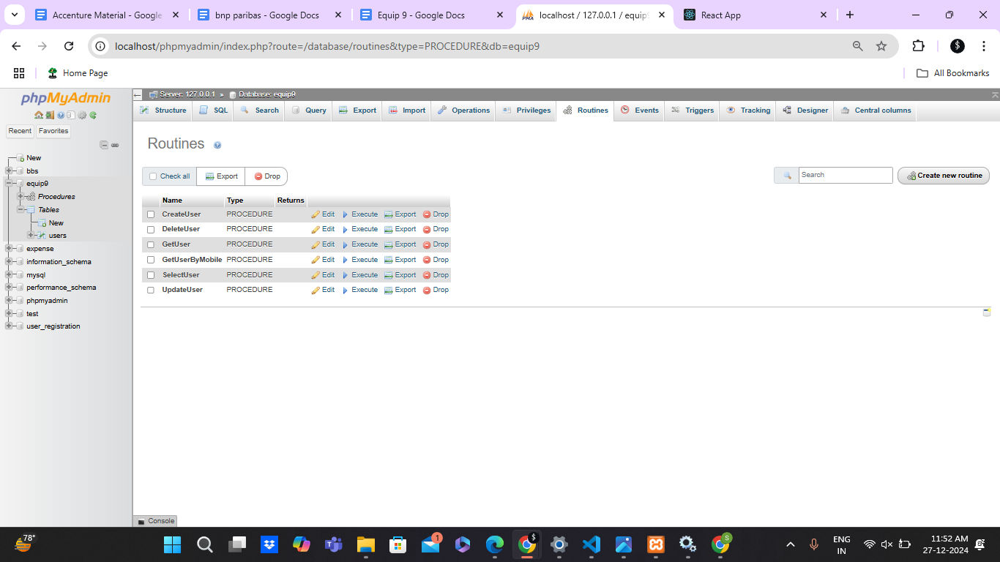
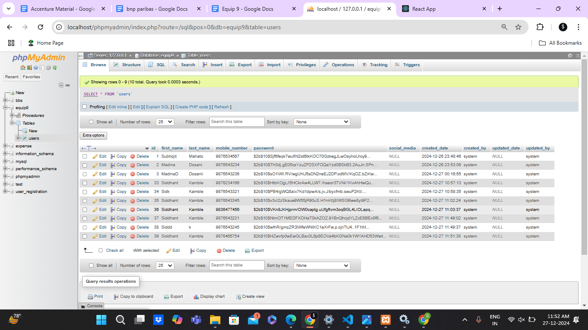
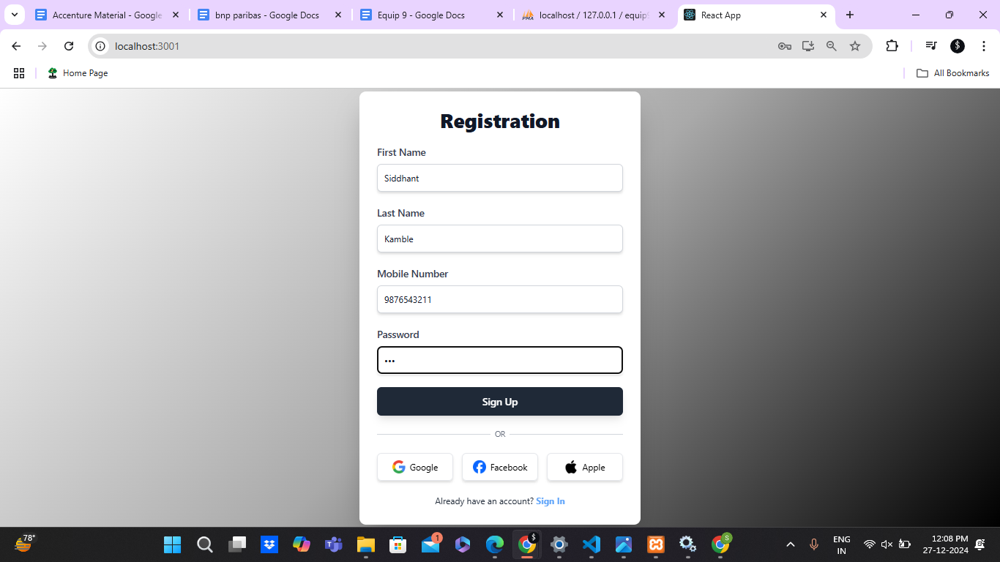
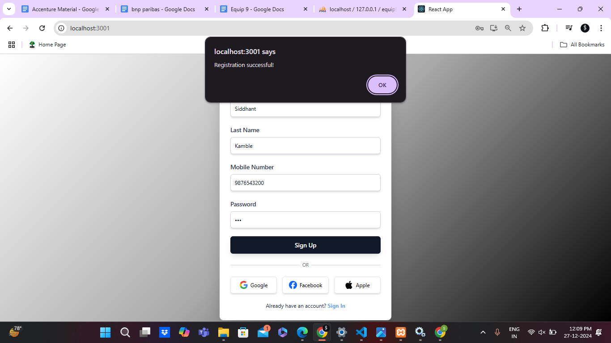
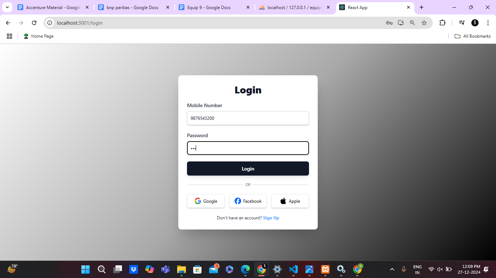
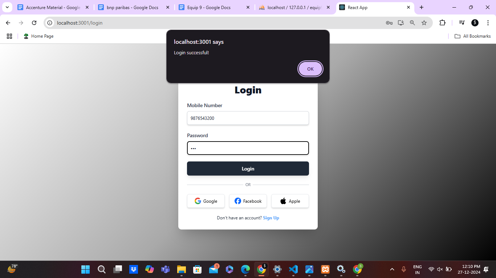
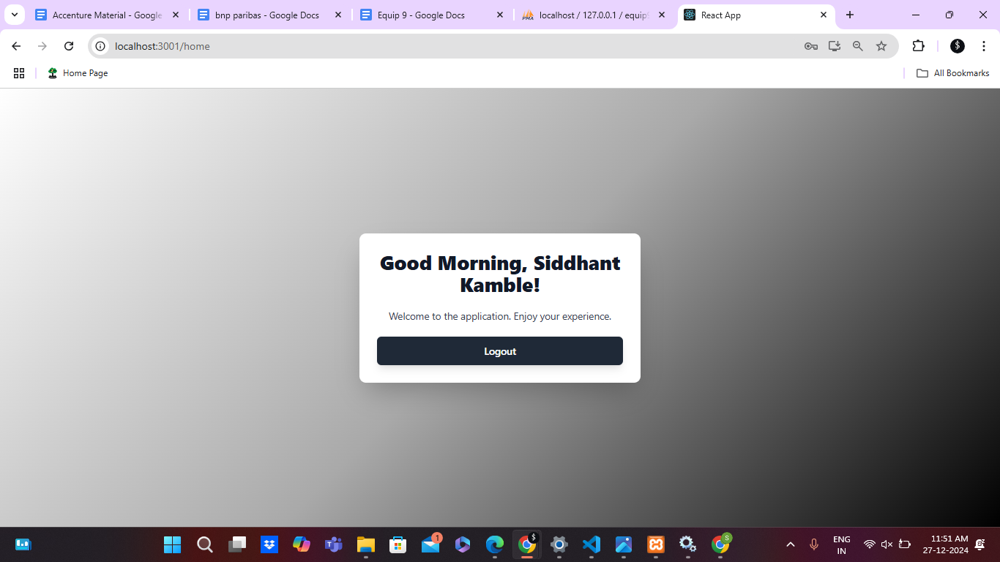

# Equip9-Assignment

This project is a web application developed as part of an assignment. 

## Prerequisites

Before you begin, ensure you have the following installed on your system:

* **Node.js (version 14.x or higher)**
* **npm (comes with Node.js)**
* **React.js**
* **Tailwind CSS**
* **XAMPP server**

## Installation

1. **Clone the repository:**
   ```bash
   git clone https://github.com/sidmercer/Equip9-Assignment/

2. **Navigate to the project directory:**
cd Equip9-Assignment


3.**Client:**
    navigate:-cd client
    install dependencies:-npm install 
    Start the client:-npm start
4.**Server:**
    navigate:-cd server 
    install dependencies:-npm install
    Start the server:-node server.js

**Project Demo:-**
Backend Xamp server
    1.procedure:-
    2.usertable:-
Frontend:-
    1.Registration:-
                    
    2.Login:-
            
    3.Home:-


    
